# Ubiquiti Monitoring Service

[](https://github.com/emil-j-olsson/ubiquiti/actions/workflows/on-pr.yaml)


<p align="center">
  
</p>

Network device monitoring service that continuously retrieve diagnostics over a network via various supported protocols (`gRPC`, `HTTP`) and operating systems (`alpine (arm64)`, `ubuntu (amd64)`, `debian (armv7)`).

## Architecture

```mermaid
%%{init: {'theme':'base', 'themeVariables': { 'clusterBkg':'transparent', 'clusterBorder':'#777', 'titleColor':'#666', 'primaryTextColor':'#444', 'lineColor':'#444'}}}%%
flowchart LR
    subgraph Frontend["Frontend Layer"]
        FE[Frontend Application]
    end

    subgraph Gateway["API Gateway Layer"]
        GRPC["gRPC Server<br/>:8080"]
        HTTP["HTTP Gateway<br/>:8081"]
    end

    subgraph Backend["Backend Monitor Services"]
        direction LR
        BM_ARM["Monitor Service<br/>(ARM64 - Alpine)<br/>:8080 gRPC / :8081 HTTP"]
        BM_AMD["Monitor Service<br/>(AMD64 - Alpine)<br/>:8082 gRPC / :8083 HTTP"]
    end

    subgraph Database["Persistence Layer"]
        PG[("PostgreSQL<br/>Ubiquiti DB")]
        NOTIFY["PG Notify<br/>device_changes"]
    end

    subgraph Workers["Background Workers"]
        direction LR
        ORCH["Orchestrator<br/>(Device Discovery)"]
        POLL["Polling Workers<br/>(HTTP/gRPC)"]
        STREAM["Streaming Workers<br/>(HTTP-Stream/gRPC-Stream)"]
    end

    subgraph Devices["Network Devices"]
        direction TB
        D_ROUTER["Dream Machine Pro Max<br/>(ARM64 - Alpine)<br/>gRPC :8084-8085"]
        D_SWITCH["Pro Max 24 PoE<br/>(AMD64 - Alpine)<br/>gRPC-Stream :8086-8087"]
        D_AP["U7 Pro Max Ultimate<br/>(ARMv7 - Debian)<br/>HTTP :8088-8089"]
    end

    %% Frontend to Gateway
    FE -->|REST/gRPC| HTTP
    FE -->|gRPC| GRPC

    %% Gateway to Backend
    HTTP -.->|Proxy| GRPC
    GRPC <-->|Service Calls| BM_ARM
    GRPC <-->|Service Calls| BM_AMD

    %% Backend to Database
    BM_ARM <-->|Read/Write| PG
    BM_AMD <-->|Read/Write| PG

    %% Database Event System
    PG -->|Emit Events| NOTIFY
    NOTIFY -.->|Subscribe| ORCH

    %% Orchestrator Workflow
    ORCH -->|Discover Devices| PG
    ORCH -.->|Spawn| POLL
    ORCH -.->|Spawn| STREAM

    %% Polling Strategy
    POLL -->|Periodic HTTP/gRPC| D_ROUTER
    POLL -->|Periodic HTTP/gRPC| D_AP
    POLL -->|Save Diagnostics| PG

    %% Streaming Strategy  
    STREAM <-->|Persistent Stream| D_SWITCH
    STREAM <-->|Persistent Stream| D_ROUTER
    STREAM -->|Save Diagnostics| PG

    %% Device Registration
    D_ROUTER -.->|Register| BM_ARM
    D_ROUTER -.->|Register| BM_AMD
    D_SWITCH -.->|Register| BM_ARM
    D_SWITCH -.->|Register| BM_AMD
    D_AP -.->|Register| BM_ARM
    D_AP -.->|Register| BM_AMD

    %%{init: {"flowchart": {"htmlLabels": false}} }%%
    classDef frontend fill:transparent,stroke:#777,stroke-width:1px
    classDef backend fill:transparent,stroke:#777,stroke-width:1px
    classDef device fill:transparent,stroke:#777,stroke-width:1px
    classDef database fill:transparent,stroke:#777,stroke-width:1px
    classDef worker fill:transparent,stroke:#777,stroke-width:1px
    classDef gateway fill:transparent,stroke:#777,stroke-width:1px

    class FE frontend
    class BM_ARM,BM_AMD backend
    class D_ROUTER,D_SWITCH,D_AP device
    class PG,NOTIFY database
    class ORCH,POLL,STREAM worker
    class GRPC,HTTP gateway
```



## Components

This monorepo contains several services and components listed below:

- [Device](device/): Network device service that exposes health status and diagnostics data via gRPC and HTTP APIs, supporting multiple protocols and platforms.
- [Monitor](backend/): Backend monitoring service that collects and persists device diagnostics from the network, manages device registration, and provides real-time data streaming capabilities.
- [Frontend](frontend/): Frontend monitoring service for visualizing network device health, diagnostics, and real-time monitoring data from Ubiquiti devices.
- [Checksum](checksum/): Lightweight SHA-256 checksum utility for generating deterministic cryptographic hashes from streaming data, used for data integrity verification between services.

View the specifics of each service e.g. endpoint documentation by following the links.

## Setup

### Github Hooks

Enable `pre-commit` and `commit-msg` hooks by running `make git/hooks` or the symlink commands individually:

```bash
make git/hooks # all hooks
# or:
ln -s $PWD/.github/hooks/pre-commit ./.git/hooks/pre-commit
ln -s $PWD/.github/hooks/commit-msg ./.git/hooks/commit-msg
```

The `pre-commit` hook performs local linting, formatting, and testing (unit & integration) before the commit step – and the `commit-msg` hook validates commit messages to comply with [conventional commits 1.0.0](https://www.conventionalcommits.org/en/v1.0.0/). 

### Environment Variables

A collection of environment variables found in `.env.example` are required to run separate components locally. Run the command `make generate/env` to transfer the content of `.env.example` to a `.env` file.

### Workspace

This multi-module workspace relies on Go workspace files, generate them by running the command `generate/work` or by manually leveraging the `go.work.example` file:

```bash
cp ./go.work.example ./go.work
go work use ./device ./backend ./checksum ./test
```

## Testing

### Environment

Run the unit tests locally by `make test/unit` or integration tests via `make test` – other useful commands for testing are:

```shell
make test           # launch integration test environment
make test/ci        # run unit tests
make test/unit      # run ci tests
```

## Development

### Environment

Start the local containerized development environment by running `make dev` or `make dev/up`. The following are useful commands to use during development:

```shell
make dev            # launch dev environment
make dev/up         # launch dev environment
make dev/logs       # view log stream
make dev/rebuild    # rebuild docker containers
make fmt            # format changed files
make fmt/global     # format all files
make lint           # lint files 
```

### Generate Enums

To enable a richer Golang implementation of enums we utilize [go-enum](https://github.com/abice/go-enum). Generate an `enum` from a `type` simply by doing the following:

```go
//go:generate go-enum

// ENUM(constantA, constantB)
type TheEnum string
```

Then call `make generate` to generate the enum files `*_enum.go`.
